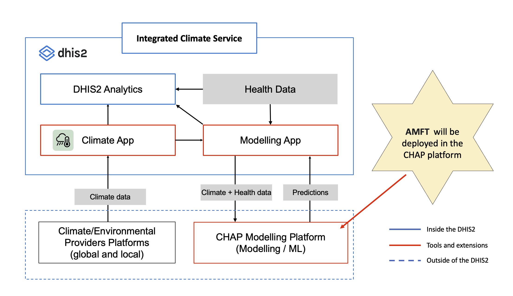
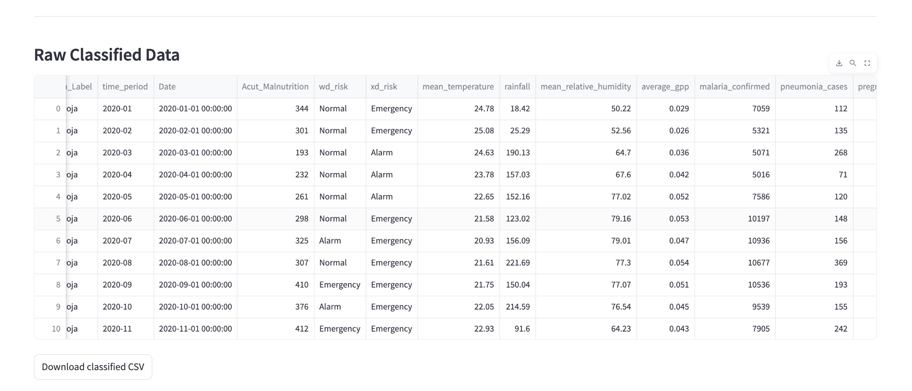
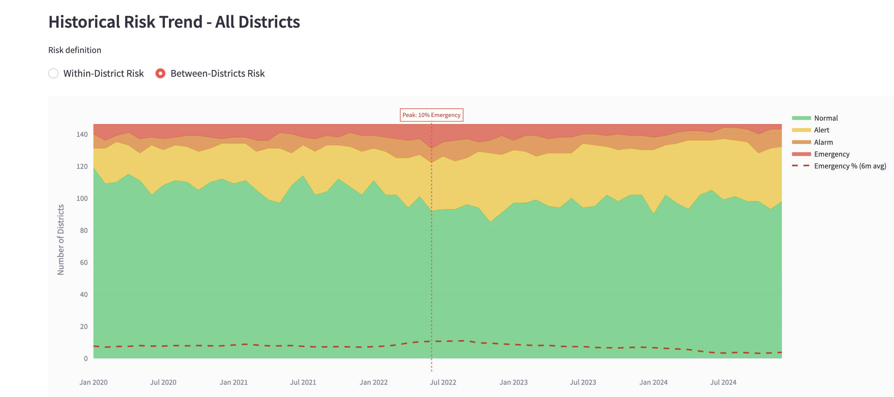
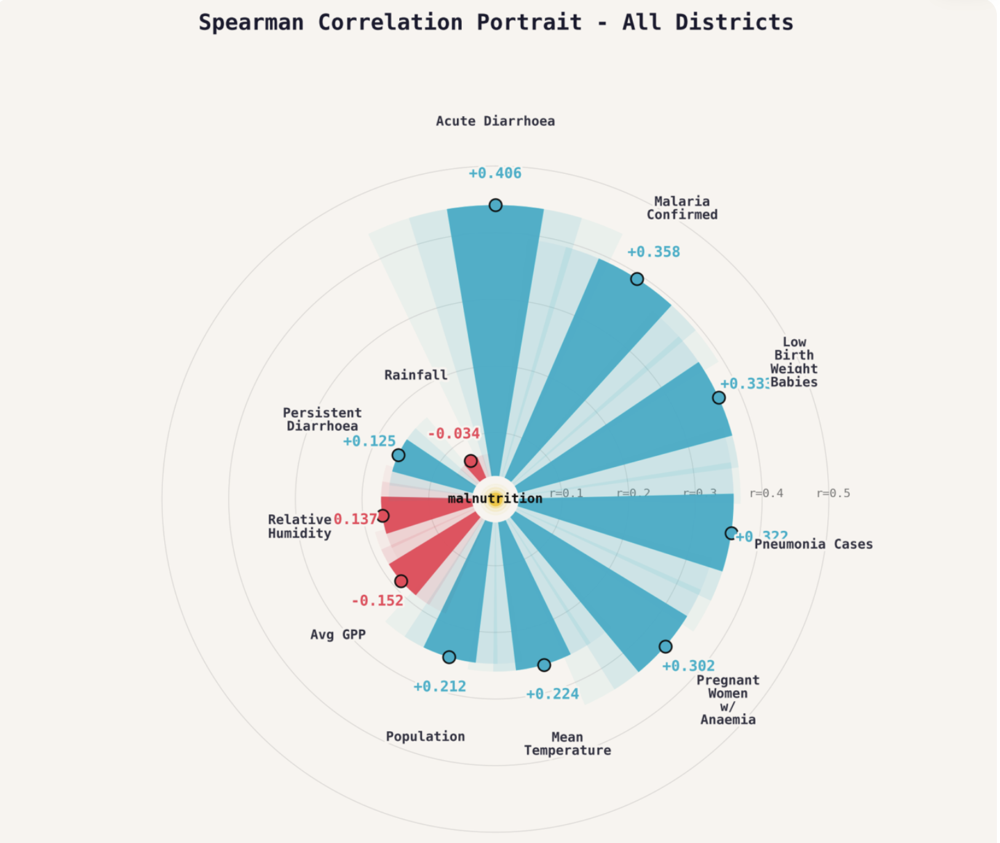
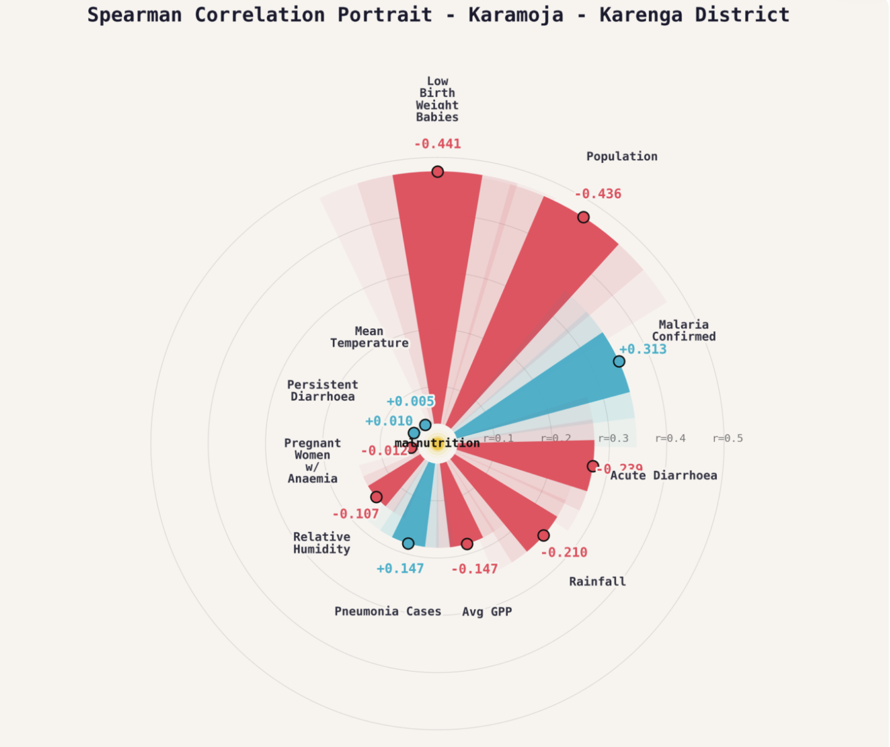
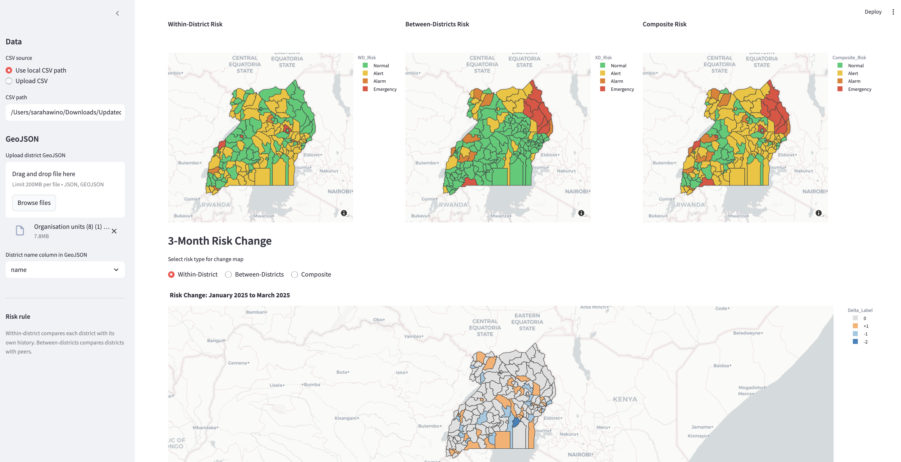
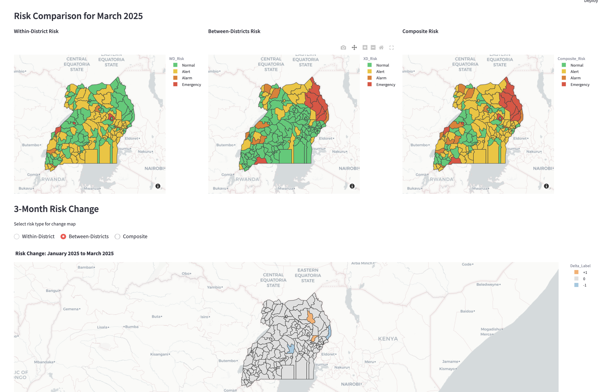

# Acute Malnutrition Forecasting Tool (AMFT)

A district-level machine learning and analytics platform for monitoring, classifying, and forecasting acute malnutrition risk in Uganda. The system integrates nutrition, climate, and environmental data with forecasting models and geospatial visualizations to support early warning, hotspot identification, and evidence-based decision-making for public health and nutrition programs. The current version is built using Streamlit and Python-based machine learning frameworks to support interactive analytics, forecasting, and visualization. The tool is currently under development and is planned for deployment and integration within the DHIS2 and Climate Health Analytics Platform (CHAP) ecosystem to support full operationalization and routine use.

# Key Features
- Integration of climate, health, nutrition, and environmental data from multiple sources
- Covariate correlation assessment and exploratory data analysis
- Descriptive analytics and trend exploration using geospatial visualisation
- Machine learning model evaluation using error metrics such as Mean Absolute Error (MAE)
- Forecasting of acute malnutrition cases using rolling predictions
- Percentile-based risk classification (Normal, Alert, Alarm, Emergency)
- Identification and mapping of malnutrition hotspots
- Visualization of spatial and temporal risk patterns through interactive dashboards and maps
- District-level early warning and decision-support analytics
- Integration-ready architecture for deployment within the DHIS2 and CHAP ecosystem

# System Architecture within the DHIS2 ecosystem

The application follows a modular workflow:

# Machine Learning Models

## Random Forest Regressor

Used for:
- Forecasting future acute malnutrition cases
- Generating three-month rolling predictions
- Estimating temporal trends in malnutrition burden

Advantages:
- Captures non-linear relationships between climate, disease, and nutrition variables
- Handles high-dimensional and complex public health datasets
- Robust to noise and missing variability in routine data
- Reduces overfitting through ensemble learning

## Random Forest Classifier

Used for:
- Classifying districts into malnutrition risk categories
- Supporting hotspot identification and early warning analysis
  
Advantages:
- Handles mixed variable types (continuous and categorical)
- Supports feature importance analysis for interpretability
- Performs well with complex variable interactions
- Provides stable classification performance for district-level risk prediction

# Data souces

The tool uses multiple datasets to support climate-informed malnutrition forecasting and risk classification, including:

- Acute malnutrition data (SAM, MAM, and related nutrition indicators) from DHIS2
- Climate indicators such as rainfall, temperature, and humidity from the DHIS2 Climate App
- Environmental indicators including Standardized Precipitation Index (SPI) and Gross Primary Productivity (GPP) sourced from NASA climate datasets
- Disease surveillance data such as malaria and diarrhoea incidence from DHIS2
- District metadata and geographic boundaries from DHIS2
- Population and demographic data for district-level analysis from DHIS2

Currently, most data are extracted and prepared outside the DHIS2 platform before being imported into the forecasting tool for analysis. Once deployed within the DHIS2 ecosystem, data integration and processing will be automated through the Climate Health Analytics Platform (CHAP) to support seamless operational use.

## Data requirements

The CSV should include:

| Column | Description |
|---|---|
| `Region_District` | Region and district, for example `Acholi|Agago District` |
| `District` | District name |
| `Region` | Region name |
| `time_period` | Monthly date, for example `2020-01` |
| `Acut_Malnutrition` | Acute malnutrition case count |
| `mean_temperature` | Mean temperature |
| `rainfall` | Rainfall |
| `mean_relative_humidity` | Relative humidity |
| `average_gpp` | Vegetation productivity |
| `malaria_confirmed` | Confirmed malaria cases |
| `pneumonia_cases` | Pneumonia cases |
| `pregnant_women_with_Anaemia` | Anaemia cases among pregnant women |
| `diarrhea_acute` | Acute diarrhoea cases |
| `low_birth_weight_babies` | Low birth weight babies |
| `diarrhea_persistent` | Persistent diarrhoea cases |
| `population` | District population |

## Metadata requirements

Upload a district GeoJSON in the sidebar. Select the GeoJSON column containing district names. The app matches those names to the CSV district names.

## App Screens

### 1. Raw Classified Data
After uploading your CSV, the app classifies each district record and displays the full dataset with within-district and between-districts risk labels.

### 2. Current Observed Risk
Choropleth maps showing the latest within-district and between-districts risk levels across all Uganda districts.

### 3. Historical Risk Trends
Stacked area chart showing how district risk levels have evolved over time, with a 6-month Emergency trend overlay.

### 4. Spearman Correlation Portrait — All Districts
Radial chart showing rank-based correlations between acute malnutrition and all covariates across all districts.

### 5. Spearman Correlation Portrait — Karaeng District
District-level Spearman correlation portrait for Karaeng District, showing local variable associations.

### 6. Forecast and 3-Month Risk Change — Within-District
3-month forecast with predicted case counts and risk change map using within-district thresholds.

### 7. Forecast and 3-Month Risk Change — Between-Districts
3-month forecast with predicted case counts and risk change map using between-districts thresholds.

## Author

Sarah Awino
